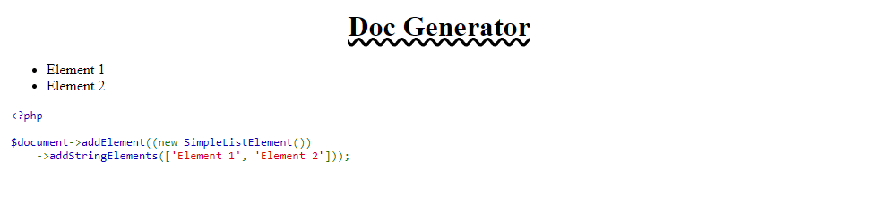

# DocGenerator

Simple document generator.

Generate simple doc with simple code like: 

````php
<?php

use App\DocumentGenerator;
use App\Enum\Align;
use App\Enum\TextAlign;
use App\Enum\TextDecoration;
use App\Model\Code\PHPCodeElement;
use App\Model\List\SimpleListElement;
use App\Model\Title\TitleElement;

require dirname(__DIR__).'/../vendor/autoload.php';

$document = new DocumentGenerator();

$document->addElement((new TitleElement('Doc Generator'))
    ->textAlign(TextAlign::CENTER)
    ->textDecorationStyle(TextDecoration::UNDERLINE_WAVY)
);

$document->addElement((new SimpleListElement())
    ->addStringElements(['Element 1', 'Element 2']));

$document->addElement((new PHPCodeElement('
$document->addElement((new SimpleListElement())
    ->addStringElements([\'Element 1\', \'Element 2\']));
'))
    ->align(Align::LEFT)
);

$document->render();
````




